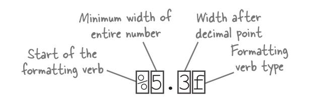
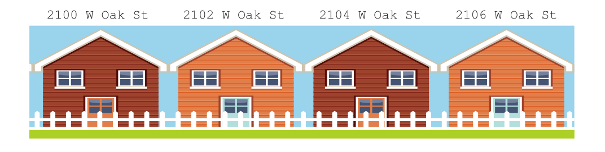

---

title: chapter 3
---


You’ve been missing outYou’ve been calling functions like a pro. But the only functions you could call were the ones Go defined for you. Now, it’s your turn. We’re going to show you how to create your own functions. We’ll learn how to declare functions with and without parameters. We’ll declare functions that return a single value, and we’ll learn how to return multiple values so that we can indicate when there’s been an error. And we’ll learn about pointers, which allow us to make more memory-efficient function calls.


# Some repetitive code		

Suppose we need to calculate the amount of paint needed to cover several walls. The manufacturer says each liter of paint covers 10 square meters. So, we’ll need to multiply each wall’s width (in meters) by its height to get its area, and then divide that by 10 to get the number of liters of paint needed.

# Formatting output with Printf and Sprintf 		

Floating-point numbers in Go are kept with a high degree of precision. This can be cumbersome when you want to display them:

```go
fmt.Println("About one-third:", 1.0/3.0)
```
About one-third: 0.3333333333333333 That’s a lot of decimal places!

To deal with these sorts of formatting issues, the fmt package provides the `Printf` function. `Printf` stands for “**print**, with **f**ormatting.” It takes a string and inserts one or more values into it, formatted in specific ways. Then it prints the resulting string.

```Go
fmt.Printf("About one-third: %0.2f\n", 1.0/3.0)
```
About one-third: 0.33 Much more readable!

The `Sprintf` function (also part of the fmt package) works just like `Printf`, except that it returns a formatted string instead of printing it.

```Go
resultString := fmt.Sprintf("About one-third: %0.2f\n", 1.0/3.0)
fmt.Printf(resultString)
```
About one-third: 0.33

It looks like `Printf` and `Sprintf` can help us limit our displayed values to the correct number of places. The question is, *how?* First, to be able to use the `Printf` function effectively, we’ll need to learn about two of its features:

- Formatting verbs (the `%0.2f` in the strings above is a verb)
- Value widths (that’s the `0.2` in the middle of the verb)


# Formatting verbs

The first argument to `Printf` is a string that will be used to format the output. Most of it is formatted exactly as it appears in the string. Any percent signs `%`, however, will be treated as the start of a **formatting verb**, a section of the string that will be substituted with a value in a particular format. The remaining arguments are used as values with those verbs.


```go
fmt.Printf("The %s cost %d cents each.\n", "gumballs", 23)
fmt.Printf("That will be $%f please.\n", 0.23 * 5)
```

The letter following the percent sign indicates which verb to use. The most common verbs are:

|Verb|Output|
|----|---------|
|%f  |  Floating-point number
|%d  |  Decimal integer
|%s  |  String
|%t  |  Boolean (true or false)
|%v  |  Any value (chooses an appropriate format based on the supplied value’s type)
|%#v |  Any value, formatted as it would appear in Go program code
|%T  |  Type of the supplied value (int, string, etc.)
|%%  |  A literal percent sign


```go
fmt.Printf("A float: %f\n", 3.1415)
fmt.Printf("An integer: %d\n", 15)
fmt.Printf("A string: %s\n", "hello")
fmt.Printf("A boolean: %t\n", false)
fmt.Printf("Values: %v %v %v\n", 1.2, "\t", true)
fmt.Printf("Values: %#v %#v %#v\n", 1.2, "\t", true)
fmt.Printf("Types: %T %T %T\n", 1.2, "\t", true)
fmt.Printf("Percent sign: %%\n")
```

Notice, by the way, that we are making sure to add a newline at the end of each formatting string using the `\n` escape sequence. This is because unlike `Println`, `Printf` does not automatically add a newline for us.

We want to point out the `%#v` formatting verb in particular. Because it prints values the way they would appear in Go code,  rather than how they normally appear, `%#v` can show you some values that would otherwise be hidden in your output. In this code, for example, %#v reveals an empty string, a tab character, and a newline, all of which were invisible when printed with %v. We’ll use `%#v` more, later in the book


# Formatting value widths	

So the `%f` formatting verb is for floating-point numbers. We can use `%f` in our program to format the amount of paint needed.

```go
fmt.Printf("%f liters needed\n", 1.8199999999999998)
```

It looks like our value is being rounded to a reasonable number. But it’s still showing six places after the decimal point, which is really too much for our current purpose.

For situations like this, formatting verbs let you specify the *width* of the formatted value.

Let’s say we want to format some data in a plain-text table. We need to ensure the formatted value fills a minimum number of spaces, so that the columns align properly.

You can specify the minimum width after the percent sign for a formatting verb. If the argument matching that verb is shorter than the minimum width, it will be padded with spaces until the minimum width is reached.

# Formatting fractional number widths

And now we come to the part that’s important for today’s
task: you can use value widths to specify the precision (the
number of displayed digits) for floating-point numbers.
Here’s the format:



The minimum width of the entire number includes decimal places
and the decimal point. If it’s included, shorter numbers will be
padded with spaces at the start until this width is reached. If it’s
omitted, no spaces will ever be added.

The width after the decimal point is the number of decimal places
to show. If a more precise number is given, it will be rounded (up or
down) to fit in the given number of decimal places.

Here’s a quick demonstration of various width values in action:

Doesn’t display an
actual value; just shows
what the verb is
These display the
actual values.
fmt.Printf("%%7.3f: %7.3f\n", 12.3456)
fmt.Printf("%%7.2f: %7.2f\n", 12.3456)
fmt.Printf("%%7.1f: %7.1f\n", 12.3456)
fmt.Printf("%%.1f: %.1f\n", 12.3456)
fmt.Printf("%%.2f: %.2f\n", 12.3456)
%7.3f: 12.346
%7.2f:
12.35
%7.1f:
12.3
%.1f: 12.3
%.2f: 12.35

That last format, "%.2f", will let us take floating-point numbers of
any precision and round them to two decimal places. (It also won’t do
any unnecessary padding.) Let’s try it with the overly precise values
from our program to calculate paint volumes.

fmt.Printf("%.2f\n", 1.2600000000000002)
fmt.Printf("%.2f\n", 1.8199999999999998)

That’s much more readable. It looks like the Printf function can
format our numbers for us. Let’s get back to our paint calculator
program, and apply what we’ve learned there.

# Using Printf in our paint calculator				

# Declaring functions

A simple function declaration
might look like this:


```go
func sayHi() {
fmt.Println("Hi!")
}
```


A declaration begins with the `func` keyword, followed by the name you want the function to have (`sayHi` above), a pair of parentheses (), and then a block containing the function’s code.

Once you’ve declared a function, you can call it elsewhere in
your package simply by typing its name, followed by a pair of
parentheses. When you do, the code in the function’s block will
be run.

import "fmt"
Declare a “sayHi” func sayHi() {
fmt.Println("Hi!")
function. }
func main() {
sayHi()
}

Notice that when we call sayHi, we’re not typing the package
name and a dot before the function name. When you call a
function that’s defined in the current package, you should not
specify the package name. (Typing main.sayHi() would
result in a compile error.)

The rules for function names are the same as the rules
for variable names:

A name must begin with a letter, followed by any
number of additional letters and numbers. (You’ll
get a compile error if you break this rule.)

Functions whose name begins with a capital letter
are exported, and can be used outside the current
package. If you only need to use a function inside
the current package, you should start its name
with a lowercase letter.

Names with multiple words should use
camelCase.

# Declaring function parameters

If you want calls to your function to include arguments, you’ll need to
declare one or more parameters. A **parameter** is a variable, local to
a function, whose value is set when the function is called.

```Go
func repeatLine(line string, times int) {
for i := 0; i < times; i++ {
		fmt.Println(line)
}
}
```

You can declare one or more parameters between the parentheses in the function declaration, separated by commas. As with any variable, you’ll need to provide a name followed by a type (float64, bool, etc.) for each parameter you declare.

If a function has parameters defined, then you’ll need to pass a matching set of arguments when calling it. When the function is run, each parameter will be set to a copy of the value in the corresponding argument. Those parameter values are then used within the code in the function block.


# Using functions in our paint calculator				

# Functions and variable scope

Our paintNeeded function declares an area variable within its function block:

```go
func paintNeeded(width float64, height float64) {
    area := width * height
    fmt.Printf("%.2f liters needed\n", area/10.0)
}
```
Declare an “area” variable.
Access the variable.

As with conditional and loop blocks, variables declared within a function block are only in scope within that function block. So if we were to try to access the area variable outside of the paintNeeded function, we’d get a compile error:

```go
func paintNeeded(width float64, height float64) {
    area := width * height
    fmt.Printf("%.2f liters needed\n", area/10.0)
}

func main() {
    paintNeeded(4.2, 3.0)
    fmt.Println(area)
}

```
Error
undefined: area
Out of scope!

But, also as with conditional and loop blocks, variables declared outside a function block will be in scope within that block. That means we can declare a variable at the package level, and access it within any function in that package.

```Go
package main

import "fmt"

var metersPerLiter float64

If we declared a variable
at the package level...

func paintNeeded(width, height float64) float64 {
    area := width * height
    return area / metersPerLiter
    ...still in scope here
}

func main() {
    metersPerLiter = 10.0
    fmt.Printf("%.2f", paintNeeded(4.2, 3.0))
}

```

# Function return values

Suppose we wanted to total the amount of paint needed for all the walls we’re going to paint. We can’t do that with our current paintNeeded function; it just prints the amount and then discards it!

```Go
func paintNeeded(width float64, height float64) {
    area := width * height
    fmt.Printf("%.2f liters needed\n", area/10.0)
}
```
Prints the amount of
paint, but then we can’t do
anything further with it!

So instead, let’s revise the paintNeeded function to return a value. Then, whoever calls it can print the amount, do additional calculations with it, or do whatever else they need.

Functions always return values of a specific type (and only that type). To declare that a function returns a value, add the type of that return value following the parameters in the function declaration. Then use the return keyword in the function block, followed by the value you want to return.

```Go
func double(number float64) float64 {
Return keyword
return number * 2
}
```


Callers of the function can then assign the return value to a variable, pass
it directly to another function, or do whatever else they need to do with it.

```Go
package main
import "fmt"
func double(number float64) float64 {
return number * 2
}
Assign return value to a variable.
func main() {
dozen := double(6.0)
fmt.Println(dozen)
fmt.Println(double(4.2))
}
```

When a return statement runs, the function exits immediately, without
running any code that follows it. You can use this together with an if
statement to exit the function in conditions where there’s no point in
running the remaining code (due to an error or some other condition).

```go
func status(grade float64) string { //If grade is failing, return immediately.
if grade < 60.0 {
		return "failing"
}
return "passing"
Only runs if grade is >= 60
}
func main() {
fmt.Println(status(60.1))
fmt.Println(status(59))
}
```

That means that it’s possible to have code that never runs under any circumstances, if you include a return statement that isn’t part of an if block. This almost certainly indicates a bug in the code, so Go helps you detect this situation by requiring that any function that declares a return type must end with a return statement. Ending with any other statement will cause a compile error.

```Go
func double(number float64) float64 {
return number * 2
Function would always exit here...
fmt.Println(number * 2)
}

```

You’ll also get a compile error if the type of your return value doesn’t match the declared return type.

Expects a floating-point number...
func double(number float64) float64 {
return int(number * 2)
...returns an integer!
}


# Using a return value in our paint calculator

Now that we know how to use function return values, let’s see if we can
update our paint program to print the total amount of paint needed in
addition to the amount needed for each wall.

We’ll update the paintNeeded function to return the amount needed.
We’ll use that return value in the main function, both to print the
amount for the current wall, and to add to a total variable that tracks
the total amount of paint needed.

```Go
package main

import "fmt"

func paintNeeded(width float64, height float64) float64 {
    area := width * height
    return area / 10.0
}

func main() {
    
    var amount, total float64
    amount = paintNeeded(4.2, 3.0)
    fmt.Printf("%0.2f liters needed\n", amount)
    total += amount
    
    amount = paintNeeded(5.2, 3.5)
    fmt.Printf("%0.2f liters needed\n", amount)
    total += amount
    fmt.Printf("Total: %0.2f liters\n", total)
}
```
1.26 liters needed
1.82 liters needed
Total: 3.08 liters

It works! Returning the value allowed our main function to decide what to do with the calculated amount, rather than relying on the paintNeeded function to print it.

# The paintNeeded function needs error handling

It looks like the paintNeeded function had no idea the argument passed
to it was invalid. It went right ahead and used that invalid argument in its
calculations, and returned an invalid result. This is a problem—even if
you knew a store where you could purchase a negative number of liters of
paint, would you really want to apply that to your house? We need a way of
detecting invalid arguments and reporting an error.

-1.26 liters needed

In Chapter 2, we saw a couple different functions that, in addition to their main return value, also return a second value indicating whether there was an error. The
strconv.Atoi function, for example, attempted to convert a string to an integer. If the conversion was successful, it returned an error value of nil, meaning our program could proceed. But if the error value wasn't nil, it meant the string couldn’t be converted to a number. In that event, we chose to print the error value and exit the program.

guess, err := strconv.Atoi(input)
If there was an if err != nil {
error, print the
log.Fatal(err)
message and exit. }
Convert the input string
to an integer.

If we want to do the same when calling the paintNeeded function, we’re
going to need two things:

- The ability to create a value representing an error
- The ability to return an additional value from paintNeeded

Let’s get started figuring this out!

# Error values

Before we can return an error value from our paintNeeded function, we need an
error value to return. An error value is any value with a method named Error that
returns a string. The simplest way to create one is to pass a string to the errors
package’s New function, which will return a new error value. If you call the Error
method on that error value, you’ll get the string you passed to `errors.New`.

```GO
package main

import (
"errors"
"fmt"
)

func main() {

err := errors.New("height can't be negative")   //Create a new error value
fmt.Println(err.Error())                        //height can't be negative
}
```
Returns the error message

But if you’re passing the error value to a function in the fmt or log packages, you
probably don’t need to call its Error method. Functions in fmt and log have been
written to check whether the values passed to them have Error methods, and print
the return value of Error if they do.

```GO
err := errors.New("height can't be negative")
fmt.Println(err)
log.Fatal(err)
```

Prints the error message
Prints the error message again,
then exits the program
height can't be negative
2018/03/12 19:49:27 height can't be negative

If you need to format numbers or other values for use in your error
message, you can use the fmt.Errorf function. It inserts values into
a format string just like fmt.Printf or fmt.Sprintf, but instead
of printing or returning a string, it returns an error value.

Returns an error value
Prints the error message
Also prints the error message
Insert a floating-point
number, rounded to two
decimal places.

err := fmt.Errorf("a height of %0.2f is invalid", -2.33333)
fmt.Println(err.Error())
f

# Declaring multiple return values

Now we need a way to specify that our paintNeeded function will
return an error value along with the amount of paint needed.

To declare multiple return values for a function, place the return value
types in a second set of parentheses in the function declaration (after the
parentheses for the function parameters), separated with commas. (The
parentheses around the return values are optional when there’s only one
return value, but are required if there’s more than one return value.)

From then on, when calling that function, you’ll need to account for the
additional return values, usually by assigning them to additional variables.

```
package main
import "fmt"
This function returns an integer, a boolean, and
a string.
func manyReturns() (int, bool, string) {
return 1, true, "hello"
}
func main() {
myInt, myBool, myString := manyReturns()
fmt.Println(myInt, myBool, myString)
1 true hello
}
```
Store each return
value in a variable.

If it makes the purpose of the return values clearer, you can supply names for
each one, similar to parameter names. The main purpose of named return values
is as documentation for programmers reading the code.

```go
package main

import (
"fmt"
"math"
)

func floatParts(number float64) (integerPart int, fractionalPart float64) {
    wholeNumber := math.Floor(number)
    return int(wholeNumber), number - wholeNumber
}

func main() {
    cans, remainder := floatParts(1.26)
    fmt.Println(cans, remainder)
}
```

# Using multiple return values with our paintNeeded function

As we saw on the previous page, it’s possible to return multiple values of any type. But the most common use for multiple return values is to return a primary return value, followed by an additional value indicating whether the function encountered an error. The additional value is usually set to nil if there were no problems, or an error value if an error occurred.

We’ll follow that convention with our paintNeeded function as well. We’ll declare that it returns two values, a float64 and an error. (Error values have a type of error.) The first thing we’ll do in the function block is to check whether the parameters are valid. If either the width or height parameter is less than 0, we’ll return a paint amount of 0 (which is meaningless, but we do have to return something), and an error value that we generate by calling fmt.Errorf. Checking for errors at the start of the function allows us to easily skip the rest of the function’s code by calling return if there’s a problem.

If there were no problems with the parameters, we proceed to calculate and return the paint amount just like before. The only other difference in the function code is that we return a second value of nil along with the paint amount, to indicate there were no errors.

```
package main
import "fmt"
Here’s the return value
with the amount of
paint, just like before.
Here’s a second return value
that will indicate whether
there were any errors.
func paintNeeded(width float64, height float64) (float64, error) {
if width < 0 {
If width is invalid, return 0 and an error.
		
return 0, fmt.Errorf("a width of %0.2f is invalid", width)
}
if height < 0 {
If height is invalid, return 0 and an error.
		
return 0, fmt.Errorf("a height of %0.2f is invalid", height)
}
Return the amount of paint, along with
area := width * height
“nil”, indicating there was no error.
return area / 10.0, nil
}
value.
Add a second variable to hold the second return
func main() {
amount, err := paintNeeded(4.2, -3.0)
fmt.Println(err)
Prints the error (or “nil” if there was none)
fmt.Printf("%0.2f liters needed\n", amount)
}
```
a height of -3.00 is invalid
0.00 liters needed


In the main function, we add a second variable to record the error value from paintNeeded. We print the error (if any), and then print the paint amount.

If we pass an invalid argument to paintNeeded, we’ll get an error return value, and print that error. But we also get 0 as the amount of paint. (As we said, this value is meaningless when there’s an error, but we had to use something for the first return value.) So we wind up printing the message “0.00 liters needed”! We’ll need to fix that...

# Always handle errors!		

When we pass an invalid argument to paintNeeded, we get an error value back, which we print for the user to see. But we also get an (invalid) amount of paint, which we print as well!


```GO
func main() {
    amount, err := paintNeeded(4.2, -3.0)
    fmt.Println(err)
    fmt.Printf("%0.2f liters needed\n", amount)
}
```

When a function returns an error value, it usually has to return a primary return value as well. But any other return values that accompany an error value should be considered unreliable, and ignored.

When you call a function that returns an error value, it’s important to test whether that value is nil before proceeding. If it’s anything other than nil, it means there’s an error that must be handled.

How the error should be handled depends on the situation. In the case of our paintNeeded function, it might be best to simply skip the current calculation and proceed with the rest of the program:

```go
func main() {
    amount, err := paintNeeded(4.2, -3.0)
    if err != nil {
        fmt.Println(err)
    } else {
    fmt.Printf("%0.2f liters needed\n", amount)
    // Additional calculations here...
    }
}

```


But since this is such a short program, you could instead call log.Fatal to display the error
message and exit the program.

```GO
func main() {
    amount, err := paintNeeded(4.2, -3.0)
    if err != nil {                         //If the error value is not nil, there must be a problem...
		log.Fatal(err)                      //…so print the error and exit the program.
    }
    fmt.Printf("%0.2f liters needed\n", amount)   // This code will never be reached if there’s an error.
}
```

The important thing to remember is that you should always check the return values to see whether there is an error. What you do with the error at that point is up to you!

# Function parameters receive copies of the arguments

As we mentioned, when you call a function that has parameters declared, you need to provide arguments to the call. The value in each argument is copied to the corresponding parameter variable. (Programming languages that do this are sometimes called “pass-by-value.”)

Go is a “pass-by-value” language; function parameters receive a **copy** of the arguments
from the function call.

This is fine in most cases. But if you want to pass a variable’s value to a function and have it change the value in some way, you’ll run into trouble. The function can only change the copy of the value in its parameter, not the original. So any changes you make within the function won’t be visible outside it!

Here’s an updated version of the double function we showed earlier. It takes a number, multiplies it by 2, and prints the result. (It uses the `*=` operator, which works just like `+=` , but it multiplies the value the variable holds instead of adding to it.)


```GO
package main

import "fmt"

func main() {
    amount := 6
    double(amount)  // Pass an argument to the function.
}

func double(number int) { // Parameter is set to a copy of the argument.
    number *= 2
    fmt.Println(number)
}
```

Suppose we wanted to move the statement that prints the doubled value from the double function back to the function that calls it, though. It won’t work, because double only alters its copy of the value. Back in the calling function, when we try to print, we’ll get the original value, not the doubled one!


```GO
func main() {
    amount := 6
    double(amount)    //Pass an argument to the function.
    fmt.Println(amount) //Prints the original value!
}

func double(number int) {    //Parameter is set to a copy of the argument.
    number *= 2       // Alters the copied value, not the original!
}

```

We need a way to allow a function to alter the original value a variable holds, rather than a copy. To learn how to do that, we’ll need to make one more detour away from functions, to learn about *pointers*.

# Pointers							

You can get the *address* of a variable using `&` (an ampersand), which is Go’s “address of ” operator. For example, this code initializes a variable, prints its value, and then prints the variable’s address...


```GO
amount := 6
fmt.Println(amount) // Retrieve the variable’s value
fmt.Println(&amount) // Retrieve the variable’s address
```

Variable’s value: 6 
Variable’s address: 0x1040a124

We can get addresses for variables of any type.
Notice that the address differs for each variable.

var myInt int
fmt.Println(&myInt)
var myFloat float64
fmt.Println(&myFloat)
var myBool bool
fmt.Println(&myBool)


And what are these “addresses,” exactly? Well, if you want to find a
particular house in a crowded city, you use its address...



Just like a city, the memory your computer sets aside for your program is a crowded place. It’s full of variable values: booleans, integers, strings, and more. Just like the address of a house, if you have the address of a variable, you can use it to find the value that variable contains.


Values that represent the address of a variable are known as pointers, because they point to the location where the variable can be found.


# Pointer types

The type of a pointer is written with a * symbol, followed by the type of the
variable the pointer points to. The type of a pointer to an int variable, for
example, would be written *int (you can read that aloud as “pointer to int”).

We can use the reflect.TypeOf function to show us the types of our pointers
from the previous program:

package main
import (
"fmt"
"reflect"
)
func main() {
var myInt int
fmt.Println(reflect.TypeOf(&myInt))
var myFloat float64
fmt.Println(reflect.TypeOf(&myFloat))
var myBool bool
fmt.Println(reflect.TypeOf(&myBool))
}
Here are the
pointer types.
*int
*float64
*bool
Get a pointer to myInt and
print the pointer’s type.
Get a pointer to myFloat
and print the pointer’s type.
Get a pointer to myBool and
print the pointer’s type.

We can declare variables that hold pointers. A pointer variable can only hold
pointers to one type of value, so a variable might only hold *int pointers, only
*float64 pointers, and so on.

Declare a variable that
holds a pointer to an int.
Assign a pointer to the
variable.
Declare a variable that holds
var myFloat float64
a pointer to a float64.
var myFloatPointer *float64
Assign a pointer to the
0x1040a128
myFloatPointer = &myFloat
0x1040a140
variable.
fmt.Println(myFloatPointer)
var myInt int
var myIntPointer *int
myIntPointer = &myInt
fmt.Println(myIntPointer)

As with other types, if you’ll be assigning a value to the pointer
variable right away, you can use a short variable declaration instead:

var myBool bool
myBoolPointer := &myBool
fmt.Println(myBoolPointe

# Getting or changing the value at a pointer

You can get the value of the variable a pointer refers to by typing the `*` operator right before the pointer in your code. To get the value at myIntPointer, for example, you’d type *myIntPointer. (There’s no official consensus on how to read * aloud, but we like to pronounce it as “value at,” so *myIntPointer is “value at myIntPointer.”)

myInt := 4
myIntPointer := &myInt
fmt.Println(myIntPointer)
fmt.Println(*myIntPointer)

myFloat := 98.6
myFloatPointer := &myFloat
fmt.Println(myFloatPointer)
fmt.Println(*myFloatPointer)

myBool := true
myBoolPointer := &myBool
fmt.Println(myBoolPointer)
fmt.Println(*myBoolPointer)

Print the pointer itself.
Print the value at the pointer.
Print the pointer itself.
Print the value at the pointer.
Print the pointer itself.
Print the value at the pointer.


The * operator can also be used to update the value at a pointer:

myInt := 4
fmt.Println(myInt)
Assign a new value to the
myIntPointer := &myInt
variable at the pointer (myInt).
*myIntPointer = 8
Print the value of the
fmt.Println(*myIntPointer)
variable
at the pointer.
fmt.Println(myInt)
Print the variable’s value directly.

In the code above, *myIntPointer = 8 accesses the variable
at myIntPointer (that is, the myInt variable) and assigns a new
value to it. So not only is the value of *myIntPointer updated, but
myInt is as well.


Initial value of myInt
Result of updating
*myIntPointer
Updated value of myInt
(same as *myIntPointer)

# Using pointers with functions

It’s possible to return pointers from functions; just declare that the function’s return type is a pointer type.

```
Declare that the function returns a float64 poin
func createPointer() *float64 {
var myFloat = 98.5
Return a pointer of the
return &myFloat
specified type.
}
func main() {
var myFloatPointer *float64 = createPointer()
fmt.Println(*myFloatPointer)
}
Print the value at
the pointer.
Assign the returned
pointer to a variable.
98.5
```

(By the way, unlike in some other languages in Go, it’s okay to return a pointer to a
variable that’s local to a function. Even though that variable is no longer in scope, as
long as you still have the pointer, Go will ensure you can still access the value.)

You can also pass pointers to functions as arguments. Just specify that
the type of one or more parameters should be a pointer.

Use a pointer type for this parameter.
func printPointer(myBoolPointer *bool) {
fmt.Println(*myBoolPointer)
Print the value at the pointer that gets passed in.
}
func main() {
var myBool bool = true
printPointer(&myBool)
}
true
Pass a pointer to the function.

Make sure you only use pointers as arguments, if that’s what the function declares it will take. If
you try to pass a value directly to a function that’s expecting a pointer, you’ll get a compile error.

func main() {
var myBool bool = true
printPointer(myBool)
}
Error


Now you know the basics of using pointers in Go. We’re ready to end our detour, and fix our double function!

# Fixing our “double” function using pointers			


# Your Go Toolbox

## Bullet Points

- The `fmt.Printf` and `fmt.Sprintf` functions format values they’re given. The first argument should be a formatting string containing verbs (%d, %f, %s, etc.) that values will be substituted for.
ƒƒ 
- Within a formatting verb, you can include a width: a minimum number of characters the formatted value will take up. For example, `%12s` results in a 12-character string (padded with spaces), `%2d` results in a 2-character integer, and `%.3f` results in a floating-point number rounded to 3 decimal places.
ƒƒ 
- If you want calls to your function to accept arguments, you must declare one or more parameters, including types for each, in the function declaration. The number and type of arguments must always match the number and type of parameters, or you’ll get a compile error.
ƒƒ 
- If you want your function to return one or more values, you must declare the return value types in the function declaration.
ƒƒ
- You can’t access a variable declared within a function outside that function. But you can access a variable declared outside a function (usually at the package level) within that function.
ƒƒ 

- When a function returns multiple values, the last value usually has a type of `error`. Error values have an `Error()` method that returns a string describing the error.
ƒƒ 
- By convention, functions return an error value of `nil` to indicate there are no errors.
ƒƒ 
- You can access the value a pointer holds by putting a `*` right before it: `*myPointer`
ƒƒ 
- If a function receives a pointer as a parameter, and it updates the value at that pointer, then the updated value will still be visible outside the function.