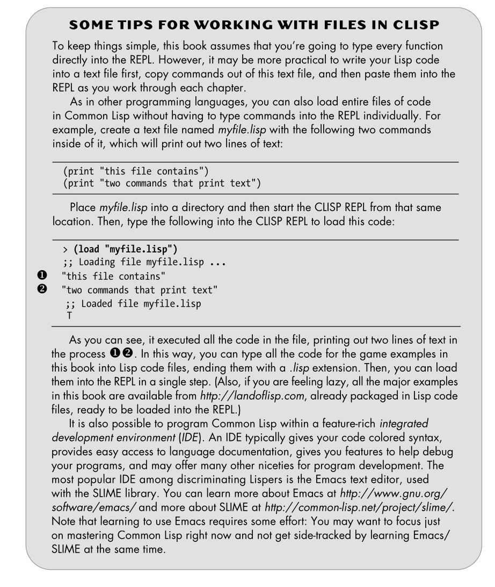

---

title: "Chapter 1: Getting started with LISP"

---

# Lisp Dialects

- hunderds of dialects, maybe thousands
- two common: ANSI Common Lisp (CL) and Scheme

# A Tale of Two Lisps 

He mentions three 

A. ANSI common
B. Scheme
C. Haskell?

# Up-and-Coming Lisps  

- clojure!!

# Lisp Dialects Used for Scripting 

- elisp
- Scheme
- Script-Fu Scheme for GIMP

# ANSI Common Lisp 

## using files

# Getting Started with CLISP 

# Installing CLISP 

# Starting Up CLISP 

# What You’ve Learned 